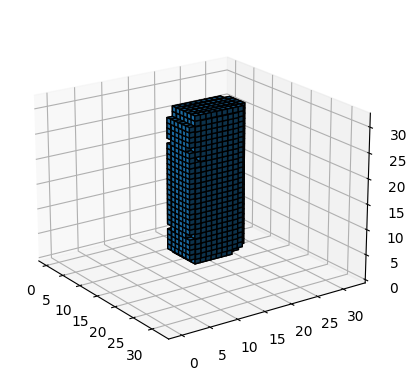
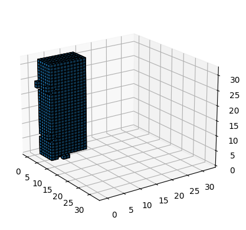
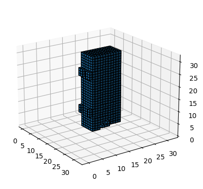
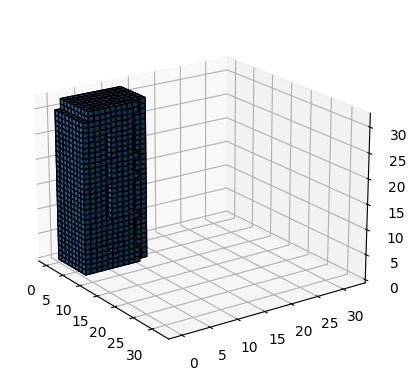
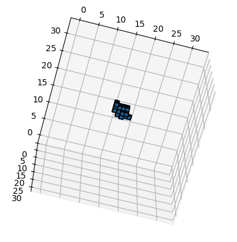
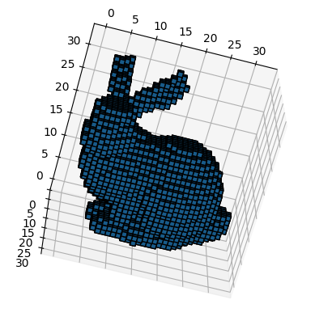
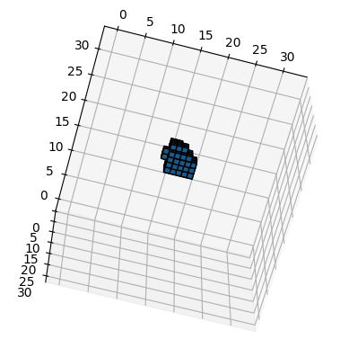
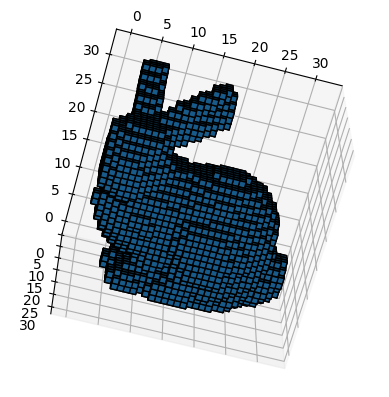

# ShapeNet Tools
The main purpose of this repo is to provide different tools to work with ShapeNet dataset.

Implemented tools (modules):
1. [Voxelization via Binvox](#voxelization)
2. [Render of the model view via Blender](#blender-model-render)
3. [Point sample](#point-sample)

Each module work independent of others tools except `utils` where placed shared code.

## Test data
The bunny object taken from [here](https://graphics.stanford.edu/~mdfisher/Data/Meshes/bunny.obj).

All examples how these tools can be used will be shown on this bunny. All results from each module will be in corresponding folder.

## Requirements
In each module\folder you can find `requirements.txt` file with specific packages if unless explicitly stated what is needed in advance.


## Voxelization
For voxelization [Binvox](https://www.patrickmin.com/binvox/) is used. In order to start with scripts inside this module, download corresponding program from origin site of this software: https://www.patrickmin.com/binvox/

How to use code in this module on ShapeNet dataset:
```bash
python3 voxelization.generate_voxels_binvox.py /path/to/ShapeNetV2 \
  -s /path/to/save/voxelized/models \ 
  -n 6 --in-unit-cube --exact-generation
```

Be default will be generated voxels from classes same as in work [3D-R2N2](https://github.com/chrischoy/3D-R2N2/tree/master). To generate from all categories, add `-d all`.

Example of how voxelize bunny can be found in [this notebook](./voxelization/test.ipynb). Notice that bunny and most others objects (not from ShapeNet) are better to generated without `--in-unit-cube` parameter, which in most cases will only be suitable for ShapeNet dataset. Also usage of the parameter `--exact-generation` is recommended because final voxel will be more accurate with this parameter.

### Why unit-cube is needed?
Here are examples of voxel generation with different parameters, firstly without `-e` in binvox call:

<table>
  <tr>
    <th><center>./binvox -bb -0.5 -0.5 -0.5 0.5 0.5 0.5 -d 32 ./shapenet_v2.obj</center></th>
    <th><center>./binvox -d 32 ./shapenet_v2.obj</center></th>
  </tr>
  <tr>
    <td></td>
    <td></td>
  </tr>
</table>

With `-e`:

<table>
  <tr>
    <th><center>./binvox -e -bb -0.5 -0.5 -0.5 0.5 0.5 0.5 -d 32 ./shapenet_v2.obj</center></th>
    <th><center>./binvox -e -d 32 ./shapenet_v2.obj</center></th>
  </tr>
  <tr>
    <td></td>
    <td></td>
  </tr>
</table>

As you can see, with `-bb` parameters model is centered and with smaller size compare to voxel without this parameter. So, without it different models could be in different positions, which could be bad for training of the neural network.

NOTICE! That unit cube only could be working for ShapeNet data, and for example on `bunny.obj` results are could be different, see examples below.

Without `-e`:
<table>
  <tr>
    <th><center>./binvox -bb -0.5 -0.5 -0.5 0.5 0.5 0.5 -d 32 ./bunny.obj</center></th>
    <th><center>./binvox -d 32 ./bunny.obj</center></th>
  </tr>
  <tr>
    <td></td>
    <td></td>
  </tr>
</table>

With `-e`:
<table>
  <tr>
    <th><center>./binvox -e -bb -0.5 -0.5 -0.5 0.5 0.5 0.5 -d 32 ./bunny.obj</center></th>
    <th><center>./binvox -e -d 32 ./bunny.obj</center></th>
  </tr>
  <tr>
    <td></td>
    <td></td>
  </tr>
</table>

If we look at the scale and translation for voxel without `-bb`, parameters are:
- Scale: 0.155159
- Translation: [-0.0943804, 0.0333099, -0.0616792]

As we can see from these parameters, that we should "zoom" bunny mesh in order to it fill full space of the voxel cube. If we force it to be in unit cube, then bunny will be very small and will affect on the final voxel quality (and for model training).


## Blender model render
Current module render each model with different random 24 views (number could be changed).

Blender version: ***3.5.0.*** 

In order to use Blender with GPU (CUDA\OPTIX) and use it in Python we must build from source Blender with corresponding parameters. Dockerfile could be find [here](https://gist.github.com/TaplierShiru/2b85e422703976aa1f9ec45db2ec5069) with comments. In the comments you could find how build it only for CPU, but it could be slower and very long if you want to generate views for ShapeNet dataset. 

How to use code in this module on ShapeNet dataset:
```bash
python3 render-blender.render_blender.py /path/to/ShapeNetV2 \
  -s /path/to/save/views -b 200 -n 6 --gpu-count 1 --overwrite
```

If you don't have gpu, just insert `--gpu-count 0` then only CPU will be used. Also this parameter support more than one GPU, i.e. next commands are possible: `--gpu-count 2`, `--gpu-count 3` and etc...

Example of how use blender scripts on bunny can be found in [this notebook](./render-blender/test.ipynb).

Known problems:
- Not well tested code for now. There could be some bugs with render.
- Object files from ShapeNetV1 doesn't loaded properly by Blender with version 3.5.0. If we attempt to load it will be dropped "Segmentation fault". ShapeNetV2 works as expected and its tested.
- Its seems that after sometime certain objects are skipped in render pipeline. Need to investigate this. For now temporary solution is to start scripts again with `--overwrite` parameter which will skip models with created views.


## Point sample
The main purpose of this module is to generate points from big-size voxel (256<sup>3</sup>). Most of the code taken from [IM-NET dataset preparation](https://github.com/czq142857/IM-NET/tree/master/point_sampling). But personally I found this code very slow and in order to speed up it I used Numba here, which gives a huge boost compare to original code.

How to use code in this module on ShapeNet dataset:
```bash
python3 point-sample.point_sample_main.py /path/to/ShapeNetV2 \
  -s /path/to/save/views -n 6
```

Example of how use point sample scripts on bunny can be found in [this notebook](./point-sample/test.ipynb).

# License
This project is licensed under the terms of the MIT license (see LICENSE for details).
